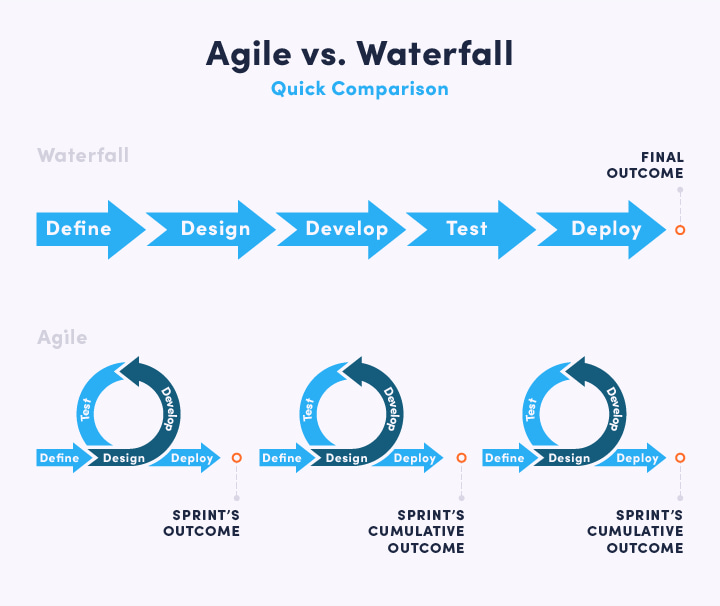

# 软件开发模型

## 软件开发生命周期

软件开发生命周期又叫做 **SDLC**（Software Development Life Cycle），它又是集合了计划、开发、测试和部署过程的集合。如下图


### 1. 问题的定义及规划

此阶段是软件开发方与需求方共同讨论，主要确定软件的开发目标及其可行性。

### 2. 需求分析

根据项目需求，团队执行一个可行性计划的分析。项目需求可能是公司内部或者客户提出的。需求分析是一个很重要的阶段，这一阶段做的好，将为整个软件开发项目的成功打下良好的基础。这阶段主要是对信息的收集，也有可能是对现有项目的改善和重新做一个新的项目。还要分析项目的预算有多少，可以从哪方面受益以及布局，这也是项目创建的目标。

### 3. 设计

此阶段主要根据需求分析的结果，对整个软件系统进行设计，如系统框架设计，数据库设计和满意状态（就是要做成什么样子，有什么功能）等等。软件设计一般分为总体设计和详细设计。计划可以用图表，布局设计或者文档的方式呈现。好的软件设计将为软件程序编写打下良好的基础。

### 4. 实现

此阶段是将软件设计的结果转换成计算机可运行的程序代码。项目经理创建和分配工作给开发者，开发者根据任务和在设计阶段定义的目标进行开发代码。依据项目的大小和复杂度，可能需要数月或者更长时间才能完成。在程序编码中必须要制定统一，符合标准的编写规范。以保证程序的可读性，易维护性，提高程序的运行效率。

### 5. 测试

在软件设计完成后要经过严密的测试，以发现软件在整个设计过程中存在的问题并加以纠正。整个测试过程分**单元测试**、**组装测试**以及**系统测试**三个阶段进行。测试的方法主要有**白盒测试**和**黑盒测试**两种。在测试过程中需要建立详细的测试计划并严格按照测试计划进行测试，以减少测试的随意性。

### 6. 维护

软件维护是软件生命周期中持续时间最长的阶段。在软件开发完成并投入使用后，由于多方面的原因，软件不能继续适应用户的要求。要延续软件的使用寿命，就必须对软件进行维护。软件的维护包括纠错性维护和改进性维护两个方面。

## 软件开发瀑布模型

瀑布模型是最著名和最常使用的软件开发模型。瀑布模型就是一系列的软件开发过程。它是由制造业繁衍出来的。一个高度化的结构流程在一个方向上流动，有点像生产线一样。在瀑布模型创建之初，没有其他开发的模型，有很多东西全靠开发人员去猜测，去开发。这样的模型仅适用于那些简单的软件开发，**已经不适合现在的开发了**。

下面是对该模型的一个简易流程图


|                  优势                  |                             劣势                             |
| :------------------------------------: | :----------------------------------------------------------: |
|             简单易用和理解             | 各个阶段的划分完全固定，阶段之间产生了大量的文档，极大的增加了工作量 |
| 当前一阶段完成后，只需要去关注后续阶段 | 由于开发模型是线性的，用户只有等到整个过程的末期才能<br />见到开发成果，从而增加了开发风险 |
|    为项目提供了按阶段划分的检查结点    |   瀑布模型的突出缺点是不适应用户需求的变化（**改 需 求**）   |

## 软件敏捷开发模型

### 什么是敏捷开发（Agile Development）

敏捷开发采用**迭代**、**循序渐进**（**增量**）的方法进行软件开发。

在敏捷开发中，软件项目在构建初期被切分成多个子项目，各个子项目的成果都经过测试，具备可视、可集成和可运行使用的特征。换言之，就是把一个大项目分为多个相互联系，但也可独立运行的小项目，并分别完成，在此过程中软件一直处于可使用状态。

### 迭代开发（Iterative Development）

对于大型项目而言，传统的开发方式是采用一个大周期（如一年）进行开发，整个过程就是一次"大开发"。

迭代开发的方式则不一样，它将开发过程拆分成多个小周期，即一次"大开发"拆分成多次的"小开发"，每次小开发都是同样的流程，所以看上去就像是重复的在做同样的步骤。

### 增量开发（Incremential Development）

软件每个版本，都会新增一个用户可以感知的完整功能。也就是说，按照新增功能来划分迭代。

### 敏捷开发的迭代方式

虽然敏捷开发将软件拆分成多个迭代，但是也要求每次迭代都是一个完整的软件开发周期，必须按照软件工程的方法论，进行正规的流程管理。



### 敏捷开发的好处

1. 早期交付，从而大大降低成本。
2. 降低风险，及时了解市场需求，降低产品不适用的风险。

# CI/CD 的概念

## 持续集成

持续集成强调开发人员**频繁自动将代码集成到主干和生产环**，随后立刻进行构建、测试。根据测试结果，我们可以确定新代码和原有代码能否正确地集成在一起。

**持续集成的目的，就是可以让产品快速迭代，同时保持高质量。**它的核心措施是，代码集成到主干之前，必须通过自动化测试。

通过持续集成，团队可以快速的从一个功能到另一个功能，简而言之，敏捷开发很大一部分都要归功于是持续集成。

## 持续交付

持续交付在持续集成的基础上，将集成后的代码部署到更贴近真实运行环境的「类生产环境」（*production-like environments*）中。

比如，我们完成单元测试后，可以把代码部署到连接数据库的 Staging 环境中更多的测试。如果代码没有问题，可以继续手动部署到生产环境中。

## 持续部署

持续部署则是在持续交付的基础上，把部署到生产环境的过程自动化。其目的是可以随时部署，迅速投入生产阶段。

持续部署这一步，意味着产品和客户见面，但是要通过重重考验，测试、构建、部署等步骤，而且每一步都是自动的。

## 持续集成的流程

根据持续集成的设计，代码从提交到生产，整个过程有以下几步：

1. 提交

流程的第一步，是开发者向代码仓库提交代码。所有的后续步骤都始于本地代码的 commit。

2. 测试（第一轮）

代码仓库对 commit 操作配置了钩子（hook），只要提交代码或者合并进主干，就会跑自动化测试。

3. 构建

通过第一轮测试，代码就可以合并进主干，就算可以交付了

交付后，就先进行构建（build），再进入第二轮测试。所谓构建，指的是将源码转换为可以运行的实际代码，比如安装依赖，配置各种资源（脚本，图片）等等。

4. 测试（第二轮）

构建完成，就要进行第二轮测试。如果第一轮测试已经涵盖了所有内容则可以省略，当然这时构建步骤也要移到第一轮测试前面。

5. 部署

经过第二轮测试，当前代码就是一个可以直接部署的版本（artifact）。将这个版本的所有文件打包存档，发到生产服务器。

6. 回滚

一旦当前版本发生问题，就要回滚到上一个版本的构建结果。最简单的做法就是修改一下符号链接，指向上一个版本的目录。

## 持续集成的组成要素

* 一个自动构建过程，从检出代码、编译构建、运行测试、结果记录、测试统计等都是自动完成的，无需人工干预。
* 一个代码存储库，即需要版本控制软件来保障代码的可维护性，同时作为构建过程的素材库，一般使用SVN或Git
* 一个持续集成服务器，Jenkins 就是一个配置简单和使用方便的持续集成服务器。

# Jenkins 持续集成工具

## 1. Jenkins介绍

Jenkins 是一款流行的开源持续集成工具，广泛用于项目开发，具有自动化构建、测试和部署等功能，[官网在这](https://www.jenkins.io/zh/)

Jenkins的特征：

* 开源的 Java 语言开发持续集成工具，支持持续集成，持续部署
* 易于安装部署配置：可通过 yum 安装，或下载war包以及通过 docker 容器等快速实现安装部署，可方便 web 界面配置管理
* 消息通知以及测试报告：集成 RSS/E-mail 通过 RSS 发布构建结果或当构建完成时通过 E-mail 通知，生成 JUnit/TestNG 测试报告
* 分布式构建：支持 Jenkins 能够让多台计算机一起构建或测试
* 文件识别：Jenkins能够跟踪哪次构建生成了哪些 jar，哪次构建使用了哪个版本的 jar 等
* 丰富的插件支持：支持扩展插件，可以开发适合自己团队的工具，例如Git、Maven、Docker等等

## 2. Jenkins安装和持续集成环境配置

### 持续集成流程


1. 开发人员每天进行代码提交到 Git仓库
2. Jenkins 作为持续集成工具，使用 Git 工具到 Git仓库 拉取代码到集成服务器，再配合 JDK、Maven 等软件完全代码编译，代码测试、审查和打包等工作，在这个过程中有一步出错，都要重新执行整个流程
3. 最后，Jenkins 把生成的 jar 或 war 包分发到测试服务器或生产服务器，测试人员和用户即可访问应用

## 3. Jenkins 安装

全新的

```basic
docker run -p 8777:8080 -p 50000:50000 --name jenkins -dit jenkins
```

功能齐全的

```bash
docker run -p 8777:8080 -p 50000:50000 --name jenkins -dit jenkins/jenkins
```

## 4. Jenkins 用户权限管理

我们可以利用 Role-based Authorization strategy 插件来管理 Jenkins 用户权限


进入`Manage Jenkins`的`Configure Global Security`，将授权策略切换为`Role-Based Strategy`

之后即可在系统管理页面进入`Manage and Assign Roles`里创建角色与用户。

当然也可以使用项目矩阵授权策略也进行权限管理。

## 5. Jenkins 凭证管理

凭据可以用在存储需要密文保护的数据库密码，Gitlab密码信息、Docker私有仓库密码等，以便 Jenkins 可以和这些第三方的应用进行交互

要在 Jenkins 使用凭证管理，需要安装`Credentials Binding`插件，安装后就会在`Manage Jenkins`里出现`Manage Credentials`菜单，在这里管理所有凭证

可以添加的凭证有以下6种


* Username with password: 用户名与密码
* GitHub App: Github身份验证
* SSH Username with private key: 使用SSH用户和密钥
* Secret file: 需要保密的文本文件，使用时 Jenkins 会将文件复制到一个临时目录中，再将文件路径设置到一个变量中，等构建结束后，所复制的 Secret file 就会被删除
* Secret text: 需要保存的一个加密的文本串，例如 Github 的 api token
* Certificate: 通过上传证书文件的方式

